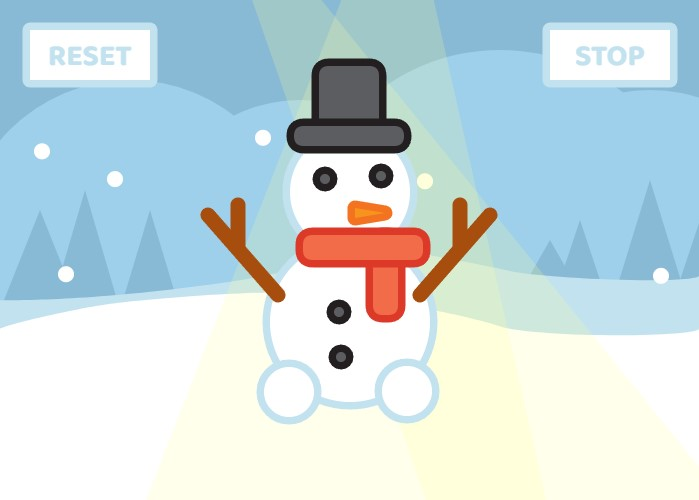

# Snowman Canvas: Dress-Up and Dance

Step into a winter wonderland of creativity with our "Snowman Canvas: Dress-Up and Dance." This delightful web-based interactive experience invites you to immerse yourself in the magic of the holiday season as you build, customize, and make your very own snowman dance with just a few clicks.

## Build Your Snowman:

With the power of HTML Canvas, you can start from scratch and build your snowman masterpiece. Begin with the two snowball body structure, add a carrot nose, coal eyes and mouth, and of course, the iconic top hat. Customize your snowman to bring your unique vision to life. The intuitive interface makes it easy for both beginners and experienced designers to create their ideal frosty friend.

## Dress the Snowman:

Take your snowman-building skills to the next level by dressing up your creation in a variety of stylish winter attire. Choose from an array of accessories to give your snowman its own personality. Whether you want a classic look or a whimsical one, the possibilities are endless.

## Make the Snowman Dance:

Now, it's time to add some holiday cheer and watch your snowman come to life! Use the interactive controls to make your snowman dance to your favorite holiday tunes.Share the joy with friends and family by showcasing your dancing snowman and spreading holiday cheer.

Credits:

- Art & Design (UI/UX): @Mo-ong

Our "Snowman Canvas: Dress-Up and Dance" is not just a creative outlet; it's a heartwarming and festive experience that allows you to celebrate the magic of the season in a unique and engaging way. Whether you're a child or simply young at heart, this project is sure to bring a smile to your face and spread holiday spirit to all who join in the fun. Start building, dressing, and dancing with your snowman today!
